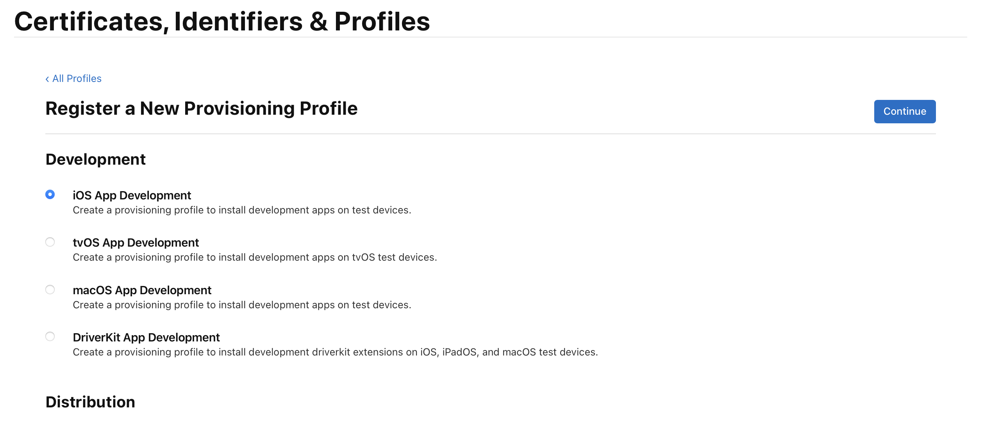

# Gigastore SDK Example App iOS

This example project embeds the Gigastore SDK and presents its functionality in a simple way.

##  Run on real device / How to sign
In order to run the application on a real device, please make sure that you have the eSIM entitlement approved by Apple. For any questions, please directly reach out to us! 

### Requirements
* Apple Developer Account
* eSIM entitlement (com.apple.CommCenter.fine-grained)

### Steps
You have to set up an identifier and a profile for this application in the Apple Developer Portal. You can follow the steps below:

1. Sign in to the Apple Developer Portal with your account
2. Navigate to https://developer.apple.com/account
3. Select "Identifiers" in the column  "Certificates, Identifiers & Profiles"
4. Create a new identifier  
	4.1. Select the + to create a new identifier  
	   
	4.2. Select "App IDs", Continue  
	 
	4.3. Select "App", Continue  
	   
	4.4. Enter a description and a unique bundle id e.g. "com.examplecorporation.gigastore-example-app". You do not need to select/specify anything else on this page.  
	   
	4.5. Select Continue and Save the identifier
5. Make sure to have a Development Certificate ready to sign your code. Read more about this at https://developer.apple.com/documentation/appstoreconnectapi/certificates  
6. Create a profile with eSIM entitlement  
	6.1. Select the  to create a new profile  
	  
	6.2. Select "iOS App Development", Continue  
	   
	6.3. Select the identifier created in Step 4, Continue   
	   
	6.4. Select the certificates that are allowed to be used with this profile, Continue  
	6.5. Add the test devices you want to use with the app, Continue  
	6.6. Select the eSIM entitlement, Continue And Save. Download and Open the Profile on your Mac.  
	   
7. Head over to Xcode and enter the Bundle Id from step 4.4 in the Project Settings > "Signing & Capabilities". Make sure to have "Automatically manage Signing" unselected. When you already downloaded the profile and opened it, it should already be available as a selection in the dropdown menu next to "Provisioning Profile". If not, then you can download or import it.  
  
9. Run the application on your device!
